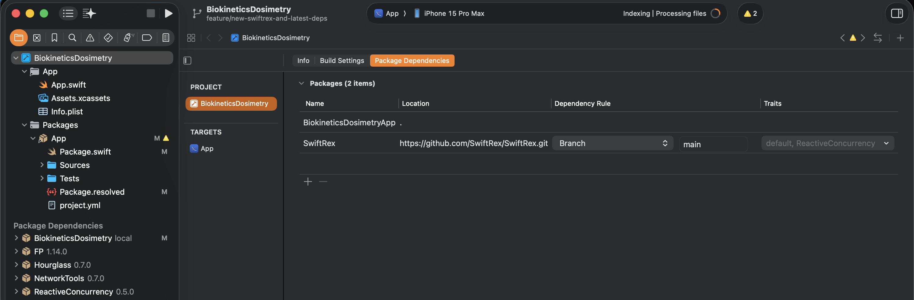

<p align="center">
	<a href="https://github.com/SwiftRex/SwiftRex/"></a><br /><br />
	Unidirectional Dataflow for Swift<br /><br />
</p>


[](https://swiftpackageindex.com/SwiftRex/SwiftRex)
[](https://swiftpackageindex.com/SwiftRex/SwiftRex)
[](https://github.com/SwiftRex/SwiftRex)
[](https://github.com/SwiftRex/SwiftRex/blob/main/LICENSE)

SwiftRex is a [Redux](https://redux.js.org/basics/data-flow)-style unidirectional-dataflow framework for Swift. One `Store` owns your whole app state; views dispatch **actions**, pure **behaviors** describe what changes and what runs, and the Store — the only thing that executes anything — handles actions, maintains state, and performs effects. It works with the reactive runtime you already use: Swift Concurrency, Combine, [RxSwift](https://github.com/ReactiveX/RxSwift), [ReactiveSwift](https://github.com/ReactiveCocoa/ReactiveSwift), or [ReactiveConcurrency](https://github.com/luizmb/ReactiveConcurrency).

- **Single source of truth** — one state tree, one store; views observe projections of it.
- **Compiler-enforced layers** — everything but the Store is an inert, composable value; there is nowhere to hide a side-effect.
- **No race conditions** — every event is an action, processed FIFO on `@MainActor`, one notification per change.
- **Testable without mocks** — environments are plain closures, logic is pure functions.
- **Modular** — features are written against their own small types and *lifted* into the app; reuse them across apps and platforms, including Linux.

[Full documentation lives in the DocC catalog](https://swiftrex.ios.lu/documentation/swiftrex) — this README is the pragmatic tour; the articles go deeper (and, where you want it, [into the algebra](https://swiftrex.ios.lu/documentation/swiftrex/algebra)).

# A feature in one screen

```swift
import SwiftRex
import SwiftRexArchitecture   // @Feature, @BoundTo
import SwiftUI

@Feature(strategy: .observationSimple)
enum Movies {
    struct State: Sendable, Equatable {
        var movies: [Movie] = []
        var isLoading = false
    }

    enum Action: Sendable {
        case onAppear
        case loaded(Result<[Movie], APIError>)
    }

    struct Environment: Sendable {
        var fetchMovies: @Sendable () async -> Result<[Movie], APIError>
    }

    static func behavior() -> Behavior<Action, State, Environment> {
        .handle { action, _ in
            switch action {
            case .onAppear:
                .reduce { $0.isLoading = true }
                .produce { ctx in Effect.task { .loaded(await ctx.environment.fetchMovies()) } }
            case .loaded(.success(let movies)):
                .reduce { $0.movies = movies; $0.isLoading = false }
            case .loaded(.failure):
                .reduce { $0.isLoading = false }
            }
        }
    }

    typealias Content = MoviesView
}

@BoundTo(Movies.self, strategy: .observationSimple)
struct MoviesView: View {
    // injected: let viewStore: ViewStore<Movies.State, Movies.Action>
    var body: some View {
        List(viewStore.state.movies) { movie in Text(movie.title) }
            .onAppear { viewStore.dispatch(.onAppear) }
    }
}
```

Everything above is a pure value. To run it, create the one object in the whole design — the `Store` — at your app's entry point:

```swift
@State var store = Store(
    initial: Movies.initialState(with: ()),
    behavior: Movies.behavior(),
    environment: Movies.Environment(fetchMovies: { await API.live.movies() })
)
```

The [Build Your First Feature](https://swiftrex.ios.lu/documentation/swiftrex/buildyourfirstfeature) article walks through this step by step.

# Installation

Swift Package Manager, Swift 6.3+ toolchain (the `@Feature` macro requires it). Platforms: macOS 13+, iOS 16+, tvOS 16+, watchOS 9+, visionOS 1+, Linux.

```swift
dependencies: [
    .package(
        url: "https://github.com/SwiftRex/SwiftRex.git",
        from: "1.0.0",
        traits: ["ReactiveConcurrency"]   // only if you use a trait-gated bridge; omit otherwise
    )
],
targets: [
    .target(name: "MyApp", dependencies: [
        .product(name: "SwiftRex", package: "SwiftRex"),
        .product(name: "SwiftRex.SwiftConcurrency", package: "SwiftRex"),
        .product(name: "SwiftRex.SwiftUI", package: "SwiftRex"),
        .product(name: "SwiftRex.Architecture", package: "SwiftRex"),
    ]),
    .testTarget(name: "MyAppTests", dependencies: [
        "MyApp",
        .product(name: "SwiftRex.Testing", package: "SwiftRex"),
    ])
]
```

Pick the products that match your project; the core is self-contained:

| Product | Trait | What it adds |
|---|---|---|
| `SwiftRex` | — | The core: store, reducers, middlewares, behaviors, effects, channels |
| `SwiftRex.SwiftConcurrency` | — | `Effect.task`/`.throwingTask`/`.asyncSequence`, `asChannel` on `AsyncSequence`, `store.stream` |
| `SwiftRex.Combine` | — | `asEffect()`/`asChannel()` on `Publisher`, `store.publisher`, `ctx.readLiveState()` |
| `SwiftRex.RxSwift` | `RxSwift` | The same bridge surface for `Observable` |
| `SwiftRex.ReactiveSwift` | `ReactiveSwift` | The same bridge surface for `SignalProducer`/`Signal` |
| `SwiftRex.ReactiveConcurrency` | `ReactiveConcurrency` | The same bridge surface for ReactiveConcurrency's cold, async/await-native `Publisher` |
| `SwiftRex.SwiftUI` | — | `ViewStore`/`TrackedViewStore` (`@Observable`, iOS 17+), `asObservableObject()` (iOS 13+), store-backed `Binding`s |
| `SwiftRex.Architecture` | — | The `@Feature` / `@BoundTo` macros and the `Relay.Scope` feature lift — `.behavior(of:)` / `.view(of:from:world:)` (Swift 6.3+) |
| `SwiftRex.Operators` | — | Symbolic operators (`<>`, `\|>`, `>>>`, …) |
| `SwiftRex.Testing` | — | `TestStore` — test target only |

The three third-party bridges are each gated behind a [package trait](https://github.com/swiftlang/swift-evolution/blob/main/proposals/0450-swiftpm-package-traits.md) of the same name, **off by default** — picking one bridge never downloads the other two. In Xcode, tick the trait in the **Traits** column of **Project ▸ Package Dependencies**:



Xcode project caveats (trait propagation in `project.pbxproj`, XcodeGen) are covered in the [Installation article](https://swiftrex.ios.lu/documentation/swiftrex/installation).

# The core loop

```
                                     ┌───────────────┐
                                     │     State     │   private to the Store
                                     └───────────────┘
                                             ▲
                                             │ maintains (mutates & reads)
   ┌──────────┐    dispatch(action)    ┌───────────────┐
   │          │ ──────────────────────▶│               │
   │   View   │                        │     Store     │
   │          │ ◀──────────────────────│               │
   └──────────┘     notifies change    └───────────────┘
                                             │   ▲
                         produce / supervise │   │ dispatch(action)
                                             ▼   │
                                     ┌───────────────┐
                                     │    Effects    │   side-effects, external I/O
                                     └───────────────┘
```

- An **Action** is a plain value describing something that happened — a tap, a response, a tick. Model them as enums, grouped per feature.
- **State** is a plain value holding everything your app knows right now — one tree, structs and enums. The Store owns it; nothing else touches it directly.
- A **Behavior** is a pure value describing how the feature responds — its **Reducer** reduces actions into state, its **Effect Producer** produces effects from actions, its **Effect Supervisor** supervises effects for a given state.
- The **Store** is the only executor. It handles actions, maintains state (one notification per change), performs effects, and loops the actions those effects dispatch back through the same path.
- A **View** observes state and dispatches actions — from the user, or any UI event.
- An **Effect** runs the side-effect and dispatches actions back to the Store, carrying in whatever the outside world (network, sensors, sockets) had to say.

Modelling tips for actions and state live in [State and Actions](https://swiftrex.ios.lu/documentation/swiftrex/stateandactions).

# Behavior — the fluent interface

`Behavior<Action, State, Environment>` is the recommended unit of logic. It fuses the three concerns a feature can have, one fluent builder per axis:

| Builder | Role | What it does |
|---|---|---|
| `.reduce { action, state in state.something = 1 }` | **Reducer** | reduces actions into state |
| `.produce { action, preCtx in Producer { ctx in ctx.environment.fetch().asEffect(Action.fetchResponse) } }` | **Effect Producer** | produces effects from actions |
| `.supervise { state in Supervision { env in state.timerRunning ? [env.timer()] : [] } }` | **Effect Supervisor** | supervises effects for a given state |

The **Store** performs the effects, maintains the state, and handles the actions — the builders only *describe*. (An Effect Producer and an Effect Supervisor together make a **Middleware**, the effect half of a behavior; the Reducer is the state half.)

Here's a location recorder — one feature that genuinely needs all three: it **reduces** each action into state, **produces** a reverse-geocode for every new location fix, and while `isRecording` holds, a **supervisor** keeps the live location stream flowing in:

```swift
let recorder = Behavior<Action, State, Environment>
    // Reducer — folds each action into the state
    .reduce { action, state in
        switch action {
        case .startTapped: state.isRecording = true
        case .stopTapped: state.isRecording = false
        case .located(let coordinate): state.route.append(coordinate)
        case .resolved(let place): state.place = place
        }
    }
    // Effect Producer — reverse-geocode each new fix, using the action's own payload
    .produce { action, _ in
        guard case .located(let coordinate) = action else { return .doNothing }
        return Producer { ctx in ctx.environment.geocode(coordinate).asEffect(Action.resolved) }
    }
    // Effect Supervisor — the live location stream, kept alive while recording
    .supervise { state in
        Supervision { env in
            state.isRecording
                ? [env.locationUpdates().asChannel(id: "location", Action.located)]
                : []
        }
    }
```

`.handle { action, ctx in … }` groups the Reducer and Effect Producer per action — switch once, and each case returns `.reduce`, `.produce`, or a chain of both. The Effect Supervisor stays separate, because it's keyed on *state*, not an action. Here `.located` is the action that carries both concerns — appending to the route **and** kicking off the geocode — co-located instead of split across two passes:

```swift
let recorder = Behavior<Action, State, Environment>
    .handle { action, _ in
        switch action {
        case .startTapped: .reduce { $0.isRecording = true }
        case .stopTapped: .reduce { $0.isRecording = false }
        case .located(let coordinate):
            .reduce { $0.route.append(coordinate) }
            .produce { ctx in ctx.environment.geocode(coordinate).asEffect(Action.resolved) }
        case .resolved(let place): .reduce { $0.place = place }
        }
    }
    .supervise { state in
        Supervision { env in
            state.isRecording
                ? [env.locationUpdates().asChannel(id: "location", Action.located)]
                : []
        }
    }
```

Behaviors compose with `<>` (or `Behavior.combine`): mutations fold in order, effects merge in parallel, supervisions union. And `.on(...)` chains declarative action-routing onto any behavior:

```swift
let routed = Behavior<AppAction, AppState, World>.identity
    .on(\.didTapLogout, dispatch: AppAction.auth(.logout))
    .on(\.didLoad, dispatch: AppAction.renderItems, when: { !$0.isLoading })
```

The full `.on` catalog (Prism, KeyPath, predicate, and pure-routing families) is on the [Behavior reference page](https://swiftrex.ios.lu/documentation/swiftrex/behavior).

# Effects: producer or supervisor?

The one design decision you'll make over and over: is this effect **produced from an action** or **supervised by state**?

| | Effect Producer — `.produce` | Effect Supervisor — `.supervise` |
|---|---|---|
| Shape | one-shot: fire → complete | long-lived: emits over time |
| Trigger | *this action happened, so produce an effect* | *the state implies the effect should exist* |
| Examples | HTTP fetch, save/delete a document, request a permission | socket, GPS stream, timer, DB observer, push listener |
| Teardown | completes by itself | leaving the state **is** the teardown |

A CRUD or document app is usually **all producers** — discrete IO, nothing long-lived. The hero example's fetch is one. A monitor-style feature — location, live prices, chat — is the genuine **supervisor** case:

```swift
let room = Behavior<RoomAction, RoomState, RoomEnv>
    .reduce { action, state in
        switch action {
        case .join(let id):    state.joinedRoom = id
        case .leave:           state.joinedRoom = nil
        case .received(let m): state.messages.append(m)
        }
    }
    .supervise { state in
        Supervision { env in
            guard let id = state.joinedRoom else { return [] }   // no room → no socket
            return [Channel(id: id) { dispatch in
                let socket = env.connect(id)
                socket.onMessage { dispatch(.received($0)) }          // events out → actions
                return ChannelHandler(receive: { socket.write($0) },  // values in → the resource
                                      cancel:  { socket.close() })    // teardown, written once
            }]
        }
    }
```

After every mutation the Store recomputes the desired channel set and **reconciles**: newly-present channels open, now-absent channels cancel, unchanged ones are left untouched. When `joinedRoom` becomes `nil` the socket closes — you never wire `socket.close()` to a `.leave` action, and you never write manual `replacing(id:)` cancellation bookkeeping. Because the desired set is a pure function of state, it can't leak and can't double-open.

Prefer a **producer** when the work is discrete and owns its own completion. Prefer a **supervisor** when the resource must live exactly as long as some state holds — if you find yourself dispatching "start X" and "stop X" action pairs and cancelling by id, that's a supervisor wanting to happen. The two also meet in the middle: a producer can send *into* a live supervised channel via `Effect.broadcast(_:channel:)` (the send half of a two-way socket).

Deep dives: [State-Driven Effects](https://swiftrex.ios.lu/documentation/swiftrex/statedriveneffects) · [Channels](https://swiftrex.ios.lu/documentation/swiftrex/channels) · worked examples for a [timer](https://swiftrex.ios.lu/documentation/swiftrex/exampletimer), [polling](https://swiftrex.ios.lu/documentation/swiftrex/examplepolling), a [chat room](https://swiftrex.ios.lu/documentation/swiftrex/examplechatroom), a [WebSocket](https://swiftrex.ios.lu/documentation/swiftrex/examplewebsocket), and [per-value delay](https://swiftrex.ios.lu/documentation/swiftrex/exampledelay).

# Pick your reactive framework

The core `Effect` is deliberately runtime-agnostic; each companion product bridges your streams into effects and channels with the same two verbs — `asEffect` to produce a one-shot effect, `asChannel` to supervise a long-lived one.

**Swift Concurrency** (`SwiftRex.SwiftConcurrency`, no third-party dependency):

```swift
// one-shot async work
.produce { ctx in
    Effect.task { .loaded(await ctx.environment.fetch()) }
}

// throwing work — the Result arrives in the action
Effect.throwingTask(Action.saved) { try await ctx.environment.save(draft) }

// any AsyncSequence becomes a supervised channel
.supervise { state in
    Supervision { env in
        guard state.isTracking else { return [] }
        return [env.locationUpdates().asChannel(id: "location", Action.located)]
    }
}

// observe the store outside SwiftUI
for await state in store.stream() { render(state) }
```

**ReactiveConcurrency** (`SwiftRex.ReactiveConcurrency`, trait-gated) — a cold, `Sendable`, async/await-native `Publisher`, ideal when your environment is `@Sendable (Args) -> Publisher<Value, Failure>`:

```swift
// Publisher → Effect; failures arrive as a Result in the action
.produce { ctx in
    ctx.environment.search(query)        // Publisher<[Movie], APIError>
        .asEffect(Action.results)        // Effect<Action>
}

// Publisher → supervised channel
.supervise { state in
    Supervision { env in
        state.isWatchingPrices ? [env.priceFeed().asChannel(id: "prices", Action.tick)] : []
    }
}

// observe the store as a cold Publisher<State, Never>
store.publisher
```

Combine (`store.publisher`, `asEffect`/`asChannel` on any `Publisher`), RxSwift (`Observable`), and ReactiveSwift (`SignalProducer`/`Signal`) expose the exact same surface — swap the runtime, keep the architecture. Mixing is fine too: Combine in the app target, a portable bridge in library code.

# Middleware and Reducer

`Behavior` is a fusion of two smaller values that still exist and compose on their own — reach for them when a unit genuinely has only one concern, or when reusing pre-Behavior code:

- **`Reducer<Action, State>`** — the **Reducer** on its own (the state half), a named pure function:

```swift
let counterReducer = Reducer<CounterAction, Int>.reduce { action, count in
    switch action {
    case .increment: count += 1
    case .decrement: count -= 1
    }
}
```

- **`Middleware<Action, State, Environment>`** — the effect half (**Effect Producer** + **Effect Supervisor**); it can read state before and after mutation but never write it:

```swift
let favorites = Middleware<FavoritesAction, FavoritesState, API>.handle { action, context in
    guard case .toggleFavorite(let id) = action else { return .doNothing }
    let wasFavorite = context.stateBefore?.favorites.contains(id) ?? false
    return .produce { ctx in
        Effect.task { .changedFavorite(await ctx.environment.setFavorite(id, to: !wasFavorite)) }
    }
}
```

Pair them back up with `Behavior(reducer:middleware:)`, or lift either half alone via `reducer.asBehavior()` / `middleware.asBehavior` and compose with `<>`. Reference: [Reducer](https://swiftrex.ios.lu/documentation/swiftrex/reducer) · [Middleware](https://swiftrex.ios.lu/documentation/swiftrex/middleware).

# The `@Feature` macro

`SwiftRex.Architecture` packages the recommended app structure. `@Feature(strategy:)` turns a namespace enum into a full feature: it applies `@ApplyOptics(recursively: true)` to `State`, `Action`, and any other nested domain type (recursive `@Lenses`/`@Prisms` down the whole tree), generates `initialState(with:)` and the SwiftUI `view(store:environment:)` factory, and generates the `Feature` conformance when the feature has a view (a view-less feature is a behavior only, with no `Feature` conformance). `@BoundTo` injects the matching `viewStore` into the view — the body never changes when you swap observation strategies.

You saw the minimal shape in the hero example. Features scale up by *adding* declarations, never rewriting: an `Environment` for dependencies, a distinct `ViewState`/`ViewAction` pair with `mapState`/`mapAction` as `Reader<Environment, …>` when the view's shape diverges from the domain's, an `Input` seed for parameterised features, `.observationGranular` for field-level view invalidation, and a `public enum` (access follows the declaration) when the feature becomes its own SPM module:

```swift
@Feature(strategy: .observationGranular)
public enum HeroDetails {
    public struct State: Sendable, Equatable { … }
    public enum Action: Sendable { … }
    public struct Environment: Sendable { … }

    public struct ViewState: Sendable, Equatable { … }   // what the pixels need
    public enum ViewAction: Sendable { case onAppear }   // what the pixels can say

    public static let mapState = Reader<Environment, @MainActor @Sendable (State) -> ViewState> { env in
        { state in ViewState(state, formatter: env.formatter) }
    }
    public static let mapAction = Reader<Environment, @Sendable (ViewAction) -> Action> { _ in
        { viewAction in .load }
    }

    public static func behavior() -> Behavior<Action, State, Environment> { … }
    public typealias Content = HeroDetailsView
    // `extension HeroDetails: Feature {}` is generated by @Feature — no hand-written conformance.
}
```

The whole L0→L4 progression — leanest feature to full module — is in the [Features article](https://swiftrex.ios.lu/documentation/swiftrex/features).

# Modularity — lifting, Relay.Scope, and bridges

Features never know about the app. They're written against local types and **lifted** to the global ones at the composition root. With `@Prisms`/`@Lenses` on the root types, lifting is just key paths:

```swift
@Prisms enum AppAction: Sendable {
    case movies(Movies.Action)
    case player(Player.Action)
}

@Lenses struct AppState: Sendable, Equatable {
    var movies = Movies.State()
    var player = Player.State()
}

let moviesBehavior: Behavior<AppAction, AppState, World> =
    Movies.behavior().lift(
        .action(\.movies)                    // PrismKeyPath — narrows incoming, embeds outgoing
            .state(\AppState.movies)         // WritableKeyPath — focus the slice
            .environment { world in Movies.Environment(fetchMovies: world.api.movies) }
    )
```

Each host's `lift` takes **one `Relay.Scope`** built axis-by-axis with the fluent builder, constrained on only the capabilities that host needs — a `Reducer` writes state, a `Middleware` only reads it, and `supervise` threads through automatically so a lifted feature's channels cancel when its sub-state disappears. Every axis accepts an optic, a key path, or plain closures — pick the minimum: `.action(prism)` / `.action(\.case)` / `.action(preview:review:)` (or `.action(preview:)` / `.action(review:)` when one direction is enough); `.state(\.slice)` / `.state { $0.slice }` / `.state(get:set:)`.

**Optionals and collections are the same builder, different hosts.** `liftOptional` is the 0-or-1 host — an `Absent` action + `Absent` environment + affine state scope (`behavior.liftOptional(.state(\.maybeChild))`, runs only while `.some`; the plain `liftOptional(\.maybeChild)` key-path form is sugar). `liftCollection` (route one addressed element) and `liftEach` (broadcast to all) are the 0-or-n hosts, and take the *same* leading-dot scope — the element-addressing rides in the lanes, so the spelling stays naked:

```swift
// route one element by Identifiable id — same shape as a single child, only the host name differs:
rowBehavior.liftCollection(.action(AppAction.prism.row).state(\AppState.rows).environment(\.rowEnv))
// locate by a custom key path, by position, or by dictionary key:
rowBehavior.liftCollection(.action(AppAction.prism.row).state(\AppState.rows, id: \.slug)…)
rowBehavior.liftCollection(.action(AppAction.prism.row).state(indexed: \AppState.rows)…)
rowBehavior.liftCollection(.action(AppAction.prism.cfg).state(dictionary: \AppState.configs)…)
// broadcast one action to every element (its action lane bridges the plain-in / id-addressed-out cases):
rowBehavior.liftEach(.action(broadcast: AppAction.prism.tickAll, into: AppAction.prism.row).state(\AppState.rows)…)
```

The lifted behavior sees the **unwrapped** element (never `Element?`), and each element's effects/channels are re-embedded and scoped to its id automatically. The same lanes drive `Reducer`/`Middleware` lifts and a per-element `store.projection(scope, element: id)` (whose state is `Element?` — the view unwraps).

**The view side inverts the store.** A projection over an optional slice is a *store of an optional*; a child screen wants an *optional store of the unwrapped value*. `transpose()` swaps the two — `Store<T?>` → `Store<T>?` — the store analogue of transposing `Optional<[T]>` ⇄ `[Optional<T>]` (it's not `sequence`: a `Store` isn't `Traversable`, only *peekable*). Map it to build an optional child view; a three-stage `Presentation` slot keeps the child live through the dismiss animation (flicker-free). Two-way bindings read state and *dispatch* on write, so the reducer stays the only writer:

```swift
// a list row → an unwrapped child store → a live child view (nil when the row is gone):
store.projection(rowScope, element: id).transpose().map { RowFeature.view(store: $0, environment: world.rowEnv) }

// two-way binding — key-path + action case, or the Relay.Scope form (Action.L == State.L):
TextField("Name", text: store.binding(\.name, set: ViewAction.setName))
TextField("Name", text: store.binding(.action(ViewAction.prism.setName).state(\.name)))
```

A **`Relay.Scope`** captures how a child feature embeds into the app — action prism, state slice, environment narrowing — as one declared, compile-checked value used by both the store fold *and* the view router. Given that wiring it lifts whatever the child provides: `.behavior(of:)` when the child is `HasBehavior`, `.view(of:from:world:)` when it is `ViewFactory`, both for a full `Feature` — so a logic-only capability lifts exactly like a screen:

```swift
enum AppScopes {                                       // one wiring per feature, declared once
    static let movies = Relay.Empty
        .action(AppAction.prism.movies)                // action prism — narrows incoming, embeds outgoing
        .state(\AppState.movies)                       // WritableKeyPath — focus the slice
        .environment { world in Movies.Environment(fetchMovies: world.api.movies) }
}

let store = Store(
    initial: AppState(),
    behavior: AppScopes.movies.behavior(of: Movies.self)
           <> AppScopes.player.behavior(of: Player.self),
    environment: world
)

// …and in the router, the same scope builds the screen:
AppScopes.movies.view(of: Movies.self, from: store, world: world)
```

**Bridge behaviors** connect modules without coupling them. Prisms compose with `>>>`, so a root-level `.on` can route one feature's output into another feature's input — neither module imports the other:

```swift
let bridge = Behavior<AppAction, AppState, World>.identity
    .on(AppAction.prism.player >>> Player.Action.prism.finished,
        dispatch: { movieID in .movies(.markWatched(movieID)) })

// compose it into the store fold like any other behavior:
behavior: AppScopes.movies.behavior(of: Movies.self)
       <> AppScopes.player.behavior(of: Player.self)
       <> bridge
```

Deep dives: [Lifting](https://swiftrex.ios.lu/documentation/swiftrex/lifting) · [Optionals and Collections](https://swiftrex.ios.lu/documentation/swiftrex/optionalsandcollections) · [Modularisation](https://swiftrex.ios.lu/documentation/swiftrex/modularisation).

# Navigation

Navigation is a function of state: routes live in the state tree, behaviors mutate them, and SwiftUI containers bind to them — every binding is a (state-path, action) pair whose setter dispatches.

| State shape | Binding | Container |
|---|---|---|
| `Route?` / `Bool` | `store.item(…)` / `store.presence(…)` | `.sheet`, `.fullScreenCover`, `.popover` |
| `[Route]` | `store.path(…)` | `NavigationStack(path:)` |
| selection enum / id | `store.selection(…)` | `TabView`, `NavigationSplitView` |
| collection of scene ids | `store.hasScene(…)` | `WindowGroup(for:)` |

```swift
NavigationStack(path: store.path(\.nav.path, set: { .nav(.setPath($0)) })) {
    HomeView()
        .navigationDestination(for: AppRoute.self) { route in
            route.view(in: store, world: world)   // a switch resolving scopes — no AnyView
        }
}
```

Dismissal is popping state, deep links are just setting state, and a route's supervised effects cancel when its state leaves the tree. The [Navigation article](https://swiftrex.ios.lu/documentation/swiftrex/navigation) covers all four shapes, `Scope`-based routers, and deep linking.

# Testing

`SwiftRex.Testing` ships `TestStore` — deterministic and exhaustive. Add it to your test target only. Because environments are plain closures, tests stub functions — no mocks, no protocols:

```swift
@MainActor
@Test func fetch_populatesBooks() async {
    let books = [Book(id: "1", title: "Dune")]

    let store = TestStore(
        initial: Library.initialState(with: .init(shelfID: "sci-fi")),
        behavior: Library.behavior(),
        environment: Library.Environment(fetch: { _ in books })
    )

    store.dispatch(.onAppear) { _ in }        // assert state; an effect is queued
    await store.runEffects()
    store.receive(Library.Action.prism.loaded) { loaded, state in
        state.books = loaded                  // describe the expected post-action state
    }
}
```

`dispatch` asserts the state after each action; `runEffects()` drives pending effects; `receive` matches produced actions by `Prism` (so `Action` needn't be `Equatable` — handy when a case carries a `Result`). By default the store fails the test on unasserted actions, leftover effects, or channels still open at deallocation; pass `exhaustive: false` to relax.

# Documentation

Start here:
[Installation](https://swiftrex.ios.lu/documentation/swiftrex/installation) ·
[Build Your First Feature](https://swiftrex.ios.lu/documentation/swiftrex/buildyourfirstfeature) ·
[Adding Effects](https://swiftrex.ios.lu/documentation/swiftrex/addingeffects) ·
[Features](https://swiftrex.ios.lu/documentation/swiftrex/features) ·
[Navigation](https://swiftrex.ios.lu/documentation/swiftrex/navigation)

Concepts:
[State and Actions](https://swiftrex.ios.lu/documentation/swiftrex/stateandactions) ·
[Lifting](https://swiftrex.ios.lu/documentation/swiftrex/lifting) ·
[Modularisation](https://swiftrex.ios.lu/documentation/swiftrex/modularisation) ·
[The Algebra](https://swiftrex.ios.lu/documentation/swiftrex/algebra)

State-driven effects:
[State-Driven Effects](https://swiftrex.ios.lu/documentation/swiftrex/statedriveneffects) ·
[Channels](https://swiftrex.ios.lu/documentation/swiftrex/channels) ·
examples: [Timer](https://swiftrex.ios.lu/documentation/swiftrex/exampletimer), [Polling](https://swiftrex.ios.lu/documentation/swiftrex/examplepolling), [Chat Room](https://swiftrex.ios.lu/documentation/swiftrex/examplechatroom), [WebSocket](https://swiftrex.ios.lu/documentation/swiftrex/examplewebsocket), [Delay](https://swiftrex.ios.lu/documentation/swiftrex/exampledelay)

Reference:
[Behavior](https://swiftrex.ios.lu/documentation/swiftrex/behavior) ·
[Reducer](https://swiftrex.ios.lu/documentation/swiftrex/reducer) ·
[Middleware](https://swiftrex.ios.lu/documentation/swiftrex/middleware) ·
[Effect](https://swiftrex.ios.lu/documentation/swiftrex/effect) ·
[Store](https://swiftrex.ios.lu/documentation/swiftrex/store)

Tooling: [LoggerMiddleware](https://github.com/SwiftRex/LoggerMiddleware) · [InstrumentationMiddleware](https://github.com/SwiftRex/InstrumentationMiddleware)

# License

Apache 2.0 — see [LICENSE](LICENSE). Contributions welcome: [CONTRIBUTING.md](CONTRIBUTING.md) · [Code of Conduct](CODE_OF_CONDUCT.md).
