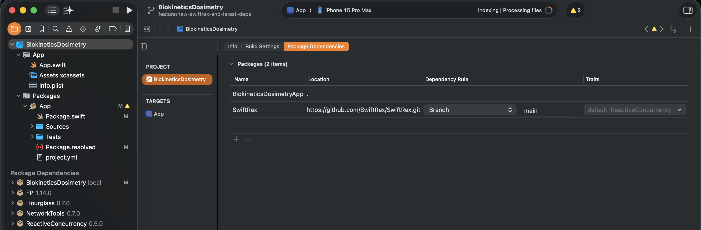

<p align="center">
	<a href="https://github.com/SwiftRex/SwiftRex/"></a><br /><br />
	Unidirectional Dataflow for Swift<br /><br />
</p>


[](https://swiftpackageindex.com/SwiftRex/SwiftRex)
[](https://swiftpackageindex.com/SwiftRex/SwiftRex)
[](https://github.com/SwiftRex/SwiftRex)
[](https://github.com/SwiftRex/SwiftRex/blob/main/LICENSE)

SwiftRex is a [Redux](https://redux.js.org/basics/data-flow)-style unidirectional-dataflow framework for Swift. One `Store` owns your app's state. Views dispatch **actions**; pure **behaviors** describe how state changes and which effects run; the Store — the only thing that executes anything — applies them. It works with the async runtime you already use: Swift Concurrency, Combine, [RxSwift](https://github.com/ReactiveX/RxSwift), [ReactiveSwift](https://github.com/ReactiveCocoa/ReactiveSwift) or [ReactiveConcurrency](https://github.com/luizmb/ReactiveConcurrency).

- **One source of truth** — one state tree, one store, read by views granularly: a view redraws only for what it reads.
- **Nowhere to hide a side effect** — everything but the Store is an inert, composable value.
- **No races** — every event is an action, processed in order on the main actor, synchronously in the same run loop.
- **Testable without mocks** — dependencies are plain closures; logic is pure functions.
- **Modular** — features are written against their own small types and *lifted* into the app; they run on Apple platforms and Linux.

This README is the tour. The [DocC catalog](https://swiftrex.ios.lu/documentation/swiftrex) goes deeper — and, if you want it, [into the algebra](https://swiftrex.ios.lu/documentation/swiftrex/algebra).

# A feature in one screen

```swift
import SwiftRex
import SwiftRexArchitecture // @Feature, @BoundTo
import SwiftRexSwiftConcurrency // Effect.task
import SwiftUI

@Feature
enum Movies {
    struct State: Sendable, Equatable {
        var movies: [Movie] = [] // Movie: Identifiable
        var isLoading = false
    }

    enum Action: Sendable {
        case onAppear
        case loaded(Result<[Movie], APIError>)
    }

    struct Environment: Sendable {
        var fetchMovies: @Sendable () async -> Result<[Movie], APIError>
    }

    static func behavior() -> Behavior<Action, State, Environment> {
        .handle { action, _ in
            switch action {
            case .onAppear:
                .reduce { $0.isLoading = true }
                .produce { ctx in Effect.task { .loaded(await ctx.environment.fetchMovies()) } }
            case let .loaded(.success(movies)):
                .reduce { state in
                    state.movies = movies
                    state.isLoading = false
                }
            case .loaded(.failure):
                .reduce { $0.isLoading = false }
            }
        }
    }

    typealias Content = MoviesView
}

@BoundTo(Movies.self) // injects `let viewStore: ViewStore<Movies.Action, Movies.State>`
struct MoviesView: View {
    var body: some View {
        List(viewStore.state.each(\.movies)) { movie in Text(movie.title) } // each row depends on its own movie
            .onAppear { viewStore.dispatch(.onAppear) }
    }
}
```

Everything above is a value. The one object in the design — the `Store` — is created once, at the app's entry point:

```swift
@main
struct MoviesApp: App {
    static let environment = Movies.Environment(fetchMovies: { await API.live.movies() })

    let store = Store(initial: Movies.initialState(with: ()), behavior: Movies.behavior(), environment: MoviesApp.environment)

    var body: some Scene {
        WindowGroup { Movies.view(store: store, environment: MoviesApp.environment) }
    }
}
```

The `App` keeps the real `Store` as a plain `let` — it is dispatched to and followed, never observed. `Movies.view(store:environment:)` (generated) makes a **view store** from it once and keeps it for the life of the view. [Build Your First Feature](https://swiftrex.ios.lu/documentation/swiftrex/buildyourfirstfeature) walks through it step by step.

# Installation

Swift Package Manager, Swift 6.3+. macOS 13+, iOS 16+, tvOS 16+, watchOS 9+, visionOS, Linux.

```swift
dependencies: [
    .package(
        url: "https://github.com/SwiftRex/SwiftRex.git",
        from: "1.0.0",
        traits: ["ReactiveConcurrency"] // only for a trait-gated bridge; omit otherwise
    )
],
targets: [
    .target(name: "MyApp", dependencies: [
        .product(name: "SwiftRex", package: "SwiftRex"),
        .product(name: "SwiftRex.SwiftConcurrency", package: "SwiftRex"),
        .product(name: "SwiftRex.SwiftUI", package: "SwiftRex"),
        .product(name: "SwiftRex.Architecture", package: "SwiftRex"),
    ]),
    .testTarget(name: "MyAppTests", dependencies: [
        "MyApp",
        .product(name: "SwiftRex.Testing", package: "SwiftRex"),
    ])
]
```

| Product | Trait | What it adds |
|---|---|---|
| `SwiftRex` | — | The core: store, behaviors, reducers, middlewares, effects, channels, `Relay.Scope` |
| `SwiftRex.SwiftConcurrency` | — | `Effect.task` / `.throwingTask` / `.asyncSequence`, `asChannel` on any `AsyncSequence` |
| `SwiftRex.Combine` | — | `asEffect()` / `asChannel()` on `Publisher`; `stateStream` is a `Publisher` |
| `SwiftRex.RxSwift` | `RxSwift` | The same bridge for `Observable` |
| `SwiftRex.ReactiveSwift` | `ReactiveSwift` | The same bridge for `SignalProducer` / `Signal` |
| `SwiftRex.ReactiveConcurrency` | `ReactiveConcurrency` | The same bridge for ReactiveConcurrency's cold, async/await-native `Publisher` |
| `SwiftRex.SwiftUI` | — | `ViewStore`, `@OwnedStore`, granular reads (Observation on iOS 17+, Combine below), bindings, presentation |
| `SwiftRex.Architecture` | — | `@Feature` / `@BoundTo`, building a child's behavior and view from one `Relay.Scope`, navigation reducers |
| `SwiftRex.Operators` | — | `<>`, `\|>`, `>>>`, … |
| `SwiftRex.Testing` | — | `TestStore` — test targets only |

The three third-party bridges are behind [package traits](https://github.com/swiftlang/swift-evolution/blob/main/proposals/0450-swiftpm-package-traits.md) of the same name, **off by default**, so picking one never downloads the others. In Xcode, tick the trait in the **Traits** column of **Project ▸ Package Dependencies**:



Xcode project caveats (trait propagation in `project.pbxproj`, XcodeGen) are in the [Installation article](https://swiftrex.ios.lu/documentation/swiftrex/installation).

# The loop

```
                                     ┌───────────────┐
                                     │     State     │   private to the Store
                                     └───────────────┘
                                             ▲
                                             │ maintains
   ┌──────────┐    dispatch(action)    ┌───────────────┐
   │          │ ──────────────────────▶│               │
   │   View   │                        │     Store     │
   │          │ ◀──────────────────────│               │
   └──────────┘   new state (stream)   └───────────────┘
                                             │   ▲
                         produce / supervise │   │ dispatch(action)
                                             ▼   │
                                     ┌───────────────┐
                                     │    Effects    │   side effects, I/O
                                     └───────────────┘
```

- An **action** is a value describing something that happened — a tap, a response, a tick.
- **State** is a value holding everything the app knows right now. The Store owns it; nobody else can even read it — a store is *followed* through its `stateStream`, and views read through a view store.
- A **behavior** describes how a feature responds: it **reduces** actions into state, **produces** effects from actions, and **supervises** long-lived effects for a given state.
- The **Store** is the only executor. It applies the behavior, publishes each new state, runs the effects and feeds the actions they dispatch back into the same loop.
- An **effect** does the I/O and reports back with actions.

Modelling tips: [State and Actions](https://swiftrex.ios.lu/documentation/swiftrex/stateandactions).

# Behavior

`Behavior<Action, State, Environment>` is the unit of logic, one builder per concern:

| Builder | Concern | Does |
|---|---|---|
| `.reduce { action, state in … }` | Reducer | folds an action into the state |
| `.produce { action, context in … }` | Effect producer | produces a one-shot effect from an action |
| `.supervise { state in … }` | Effect supervisor | keeps long-lived effects alive while the state calls for them |

They only *describe*; the Store does the work. A location recorder that needs all three — it records each fix, reverse-geocodes it, and keeps the location stream open while recording:

```swift
let recorder = Behavior<Action, State, Environment>
    .handle { action, _ in // reduce + produce, per action
        switch action {
        case .startTapped: .reduce { $0.isRecording = true }
        case .stopTapped: .reduce { $0.isRecording = false }
        case let .located(coordinate):
            .reduce { $0.route.append(coordinate) }
            .produce { ctx in ctx.environment.geocode(coordinate).asEffect(Action.resolved) }
        case let .resolved(place): .reduce { $0.place = place }
        }
    }
    .supervise { state in // keyed on state, not on an action
        Supervision { env in
            state.isRecording ? [env.locationUpdates().asChannel(id: "location", Action.located)] : []
        }
    }
```

Behaviors compose with `<>` (or `Behavior.combine([…])`): mutations fold in order, effects run in parallel, supervisions union. `.on` routes one action into another declaratively:

```swift
let routed = Behavior<AppAction, AppState, World>.identity
    .on(.action(\.didTapLogout), dispatch: .action { _ in .auth(.logout) })
    .on(.action(\.didLoad), when: { !$0.isLoading }, dispatch: .action(\.renderItems))
    .on(.action(\.select)) { id, state in state.selected = id } // reduce only
```

A behavior is a fusion of two smaller values that also work alone: `Reducer<Action, State>` (the state half) and `Middleware<Action, State, Environment>` (the effect half, which reads state but never writes it). Pair them with `Behavior(reducer:middleware:)`. Reference: [Behavior](https://swiftrex.ios.lu/documentation/swiftrex/behavior) · [Reducer](https://swiftrex.ios.lu/documentation/swiftrex/reducer) · [Middleware](https://swiftrex.ios.lu/documentation/swiftrex/middleware).

# Effects: produced or supervised?

The design decision you'll make most often:

| | Produced — `.produce` | Supervised — `.supervise` |
|---|---|---|
| Shape | one-shot: fire, complete | long-lived: emits over time |
| Reason | *this action happened* | *the state says it should exist* |
| Examples | an HTTP call, saving a document, a permission request | a socket, a GPS stream, a timer, a database observer |
| Teardown | ends by itself | leaving the state **is** the teardown |

A CRUD app is mostly produced effects. A live feature — location, prices, chat — is the supervised case:

```swift
let room = Behavior<RoomAction, RoomState, RoomEnv>
    .reduce { action, state in
        switch action {
        case let .join(id): state.joinedRoom = id
        case .leave: state.joinedRoom = nil
        case let .received(message): state.messages.append(message)
        }
    }
    .supervise { state in
        Supervision { env in
            guard let id = state.joinedRoom else { return [] } // no room → no socket
            return [
                Channel(id: id) { dispatch in
                    let socket = env.connect(id)
                    socket.onMessage { dispatch(.received($0)) } // events out → actions
                    return ChannelHandler(receive: { socket.write($0) }, cancel: { socket.close() })
                }
            ]
        }
    }
```

After every state change the Store reconciles the channels the state asks for: new ones open, missing ones cancel, unchanged ones are left alone. When `joinedRoom` becomes `nil` the socket closes — no `.leave` handler calls `close()`, no cancellation bookkeeping. If you find yourself dispatching "start X" / "stop X" pairs and cancelling by id, that's a supervisor waiting to happen. A produced effect can still send *into* a live channel with `Effect.broadcast(_:channel:)`.

Deep dives: [State-Driven Effects](https://swiftrex.ios.lu/documentation/swiftrex/statedriveneffects) · [Channels](https://swiftrex.ios.lu/documentation/swiftrex/channels) · examples: [timer](https://swiftrex.ios.lu/documentation/swiftrex/exampletimer), [polling](https://swiftrex.ios.lu/documentation/swiftrex/examplepolling), [chat room](https://swiftrex.ios.lu/documentation/swiftrex/examplechatroom), [WebSocket](https://swiftrex.ios.lu/documentation/swiftrex/examplewebsocket), [delay](https://swiftrex.ios.lu/documentation/swiftrex/exampledelay).

# Your async runtime

`Effect` is runtime-agnostic. Every bridge has the same two verbs — `asEffect` for a one-shot effect, `asChannel` for a supervised one — and turns `stateStream` into that runtime's own type.

```swift
// Swift Concurrency
.produce { ctx in Effect.task { .loaded(await ctx.environment.fetch()) } }
Effect.throwingTask(Action.saved) { try await environment.save(draft) } // the Result arrives in the action
env.locationUpdates().asChannel(id: "location", Action.located) // any AsyncSequence
for await state in store.stateStream { render(state) } // current state first

// ReactiveConcurrency, Combine, RxSwift, ReactiveSwift — the same surface
ctx.environment.search(query).asEffect(Action.results) // a Publisher / Observable / SignalProducer
env.priceFeed().asChannel(id: "prices", Action.tick)
store.stateStream // a Combine Publisher, an RxSwift Observable, a SignalProducer; `.asPublisher` for ReactiveConcurrency
```

Swap the runtime, keep the architecture — or mix them.

# SwiftUI

A plain store can't be read — only followed. Views read through a **`ViewStore`**, the one store with a snapshot and observation:

```swift
struct PlayerScreen: View {
    @OwnedStore var viewStore: ViewStore<PlayerAction, PlayerState>

    init(store: some StoreType<PlayerAction, PlayerState>) {
        _viewStore = OwnedStore(wrappedValue: store.viewStore()) // made explicitly, kept once
    }

    var body: some View {
        Text(viewStore.state.title) // depends on \.title only
        TransportBar(transport: viewStore.state.transport) // a position: the subview depends on what it reads
        Slider(value: viewStore.binding(.state(\.volume).action(\.setVolume))) // reads state, dispatches on write
        Button("Next") { viewStore.dispatch(.next) }
    }
}
```

- **Making and keeping.** `store.viewStore()` makes a view store from any store; `@OwnedStore` keeps it in the view that uses it (`@Feature` does both for you). Views below take a plain `let viewStore`. The strategy is picked where it's made: Observation on iOS 17+, Combine below, or `.viewStore(.combine)` to force it.
- **Granular reads.** `viewStore.state.x` records exactly which key paths a view reads, at any depth, and only views whose paths changed redraw. A 10 Hz playhead redraws the one view that shows it.
- **Children are pure stages.** Derive a child from a view store and hand it to the child view, which keeps its own view store:

```swift
PlayerView(store: viewStore.projection(.action(\.player).state(\.player))) // a slice

if let detail = viewStore.traverse(.action(\.detail).state(\.detail)) { // an optional (or Presentation) slot
    DetailView(store: detail) // present while it's there; holds its last value while it animates away
}

ForEach(viewStore.each(.action(\.row).state(\.rows))) { row in RowView(store: row) } // rows that dispatch or bind
```

- **Lists are cheap when rows only display.** `ForEach(viewStore.state.each(\.rows)) { RowLabel(row: $0) }` gives each row a position in the one view store: an unrelated change costs microseconds for thousands of rows. Give a row its own view store (`each(scope)`) only when it dispatches or binds — each costs a few microseconds per change.
- **Bindings** are one form, `binding(.state(…).action(…))`: two-way for a value, dismiss-only for an optional, both dismissal edges for a `Presentation`.

[Observing a Store in SwiftUI](https://swiftrex.ios.lu/documentation/swiftrex/observinginswiftui) · [Stores at a Glance](https://swiftrex.ios.lu/documentation/swiftrex/storesataglance) · [Features](https://swiftrex.ios.lu/documentation/swiftrex/features)

## The `@Feature` macro

`@Feature` turns a namespace `enum` into a feature: optics on every nested domain type (`@Lenses`, `@Prisms`), `initialState(with:)`, a `view(store:environment:)` that keeps its view store, and the `Feature` conformance. `@BoundTo` injects the view's `let viewStore`. Features grow by *adding* declarations — an `Environment`, a `ViewState`/`ViewAction` with `mapState`/`mapAction` when the screen's shape differs from the domain's, an `Input` seed, `public` when it becomes its own module:

```swift
@Feature
public enum HeroDetails {
    public struct State: Sendable, Equatable { … }
    public enum Action: Sendable { … }
    public struct Environment: Sendable { … }

    public struct ViewState: Sendable, Equatable { … } // what the pixels need
    public enum ViewAction: Sendable { case onAppear } // what the pixels can say

    public static let mapState = Reader<Environment, @MainActor @Sendable (State) -> ViewState> { env in
        { state in ViewState(state, formatter: env.formatter) }
    }
    public static let mapAction = Reader<Environment, @Sendable (ViewAction) -> Action> { _ in { _ in .load } }

    public static func behavior() -> Behavior<Action, State, Environment> { … }
    public typealias Content = HeroDetailsView
}
```

The whole progression, from the leanest feature to a full module: [Features](https://swiftrex.ios.lu/documentation/swiftrex/features).

# Modularity — one `Relay.Scope`

Features never know about the app. They are written against their own types and **lifted** into the app's at the composition root, through a `Relay.Scope`: how the child's actions, state and environment sit inside the parent's. The same scope lifts the behavior, projects the store, and builds the view.

```swift
@Prisms enum AppAction: Sendable {
    case movies(Movies.Action)
    case player(Player.Action)
}

@Lenses struct AppState: Sendable, Equatable {
    var movies = Movies.State()
    var player = Player.State()
}

enum AppFeature: Rig { // the app's (Action, State, Environment)
    typealias Action = AppAction
    typealias State = AppState
    typealias Environment = World
}

enum AppScopes { // one wiring per feature, declared once
    static let movies = ScopeOf<AppFeature>
        .action(\.movies) // `\.case` key path: narrows incoming actions, embeds outgoing ones
        .state(\.movies) // the slice
        .environment { world in Movies.Environment(fetchMovies: world.api.movies) }
}

let store = Store(
    initial: AppState(),
    behavior: AppScopes.movies.behavior(of: Movies.self) <> AppScopes.player.behavior(of: Player.self),
    environment: world
)

// and in the router, the same scope builds the screen:
AppScopes.movies.view(of: Movies.self, from: viewStore, world: world)
```

Inline scopes work the same way — `Movies.behavior().lift(.action(\.movies).state(\.movies).environment(…))`. Every lane takes the minimum it needs: a `\.case` key path, a key path, a prism, a lens, an affine traversal or plain closures. Optionals and collections use the same builder with a different host:

```swift
let rows: Behavior<AppAction, AppState, World> = Behavior.combine([
    detailBehavior.liftOptional(.state(\AppState.detail)), // runs only while `detail` is there
    rowBehavior.liftCollection(.action(\.row).state(\.rows).environment(\.rowEnv)), // one element, by id
    rowBehavior.liftEach(.action(broadcast: \.tickAll, into: \.row).state(\.rows).environment(\.rowEnv)), // every element
])
```

A collection lane locates elements by `Identifiable` id, a custom id (`.state(\.rows, id: \.slug)`), position (`.state(indexed:)`) or key (`.state(dictionary:)`); each element's effects are scoped to its id.

**Bridges** connect features without coupling them — a root-level `.on` routes one feature's output into another's input, and neither module imports the other:

```swift
let bridge = Behavior<AppAction, AppState, World>.identity
    .on(.action(\.player.finished), dispatch: .action { movieID in .movies(.markWatched(movieID)) })
```

Deep dives: [Lifting](https://swiftrex.ios.lu/documentation/swiftrex/lifting) · [Optionals and Collections](https://swiftrex.ios.lu/documentation/swiftrex/optionalsandcollections) · [Modularisation](https://swiftrex.ios.lu/documentation/swiftrex/modularisation).

# Navigation

Navigation is state: routes live in the state tree, behaviors change them, and SwiftUI containers bind to them.

| State | Binding | Container |
|---|---|---|
| `Route?` — the optional is the content | `viewStore.binding(.state(\.route).action(\.dismiss))` | `.sheet`, `.fullScreenCover`, `.popover` |
| `Presentation<Child>` + `PresentationAction` | `viewStore.binding(.state(\.editor).action(\.editor))` — straight into `.sheet(item:)` | `.sheet`, `.fullScreenCover`, `.popover` |
| `[Route]` | `viewStore.binding(.state(\.path).action(\.nav.setPath))` | `NavigationStack(path:)` |
| a selection | `viewStore.binding(.state(\.tab).action(\.tab.select))` | `TabView`, `NavigationSplitView` |
| open scenes | `viewStore.hasScene(…)` | `WindowGroup(for:)` |

```swift
NavigationStack(path: viewStore.binding(.state(\.path).action(\.nav.setPath))) {
    HomeView(viewStore: viewStore)
        .navigationDestination(for: AppRoute.self) { route in router.view(for: route) }
}
.sheet(item: viewStore.binding(.state(\.editor).action(\.editor))) { _ in
    AppScopes.editor.view(of: Editor.self, from: viewStore, world: world) // present while presented or dismissing
}
```

A router builds each destination from its declared scope — total, optional or `Presentation` slot alike — handing the child a pure stage; the child's view keeps its own view store. Dismissing is changing state, a deep link is setting state, and a route's supervised effects stop when its state leaves the tree. `StackNavigation`, `ModalNavigation` and `SelectionNavigation` come with ready-made reducers. [Navigation](https://swiftrex.ios.lu/documentation/swiftrex/navigation) · [Navigation End to End](https://swiftrex.ios.lu/documentation/swiftrex/navigationendtoend)

# Testing

`TestStore` (`SwiftRex.Testing`) is deterministic and exhaustive. Dependencies are plain closures, so tests stub functions — no mocks:

```swift
@MainActor
@Test func loadingFillsTheShelf() async {
    let books = [Book(id: "1", title: "Dune")]
    let store = TestStore(
        initial: Library.initialState(with: .init(shelfID: "sci-fi")),
        behavior: Library.behavior(),
        environment: Library.Environment(fetch: { _ in books })
    )

    store.dispatch(.onAppear) { $0.isLoading = true } // describe the state after the action
    await store.runEffects() // run what it produced
    store.receive(\.loaded) { loaded, state in // the action the effect sent back
        state.isLoading = false
        state.books = loaded
    }
}
```

`receive` matches by `\.case` key path, so `Action` needn't be `Equatable`. Effects run through the production effect engine (scheduling and channels included) and supervision runs as in the Store; inject a test clock to drive time. By default a test fails on an unasserted action, a leftover effect, or an effect channel left open (one the state still keeps is fine); `exhaustive: false` relaxes it. `TestStore` is also a store: project it, or run a real view against `testStore.viewStore()`.

# Coming from SwiftRex 0.8

This is a ground-up rewrite — `CombineRex`, `ReduxStoreBase` and the old middleware protocol don't carry over. The [CHANGELOG](CHANGELOG.md) summarises what changed, and [Migrating to ViewStore and StateStream](https://swiftrex.ios.lu/documentation/swiftrex/migratingtoviewstore) has the mechanical steps.

# Documentation

Start here:
[Installation](https://swiftrex.ios.lu/documentation/swiftrex/installation) ·
[Build Your First Feature](https://swiftrex.ios.lu/documentation/swiftrex/buildyourfirstfeature) ·
[Adding Effects](https://swiftrex.ios.lu/documentation/swiftrex/addingeffects) ·
[Features](https://swiftrex.ios.lu/documentation/swiftrex/features) ·
[Observing a Store in SwiftUI](https://swiftrex.ios.lu/documentation/swiftrex/observinginswiftui) ·
[Navigation](https://swiftrex.ios.lu/documentation/swiftrex/navigation)

Concepts:
[State and Actions](https://swiftrex.ios.lu/documentation/swiftrex/stateandactions) ·
[Stores at a Glance](https://swiftrex.ios.lu/documentation/swiftrex/storesataglance) ·
[Lifting](https://swiftrex.ios.lu/documentation/swiftrex/lifting) ·
[Optionals and Collections](https://swiftrex.ios.lu/documentation/swiftrex/optionalsandcollections) ·
[Modularisation](https://swiftrex.ios.lu/documentation/swiftrex/modularisation) ·
[The Algebra](https://swiftrex.ios.lu/documentation/swiftrex/algebra)

State-driven effects:
[State-Driven Effects](https://swiftrex.ios.lu/documentation/swiftrex/statedriveneffects) ·
[Channels](https://swiftrex.ios.lu/documentation/swiftrex/channels) ·
examples: [Timer](https://swiftrex.ios.lu/documentation/swiftrex/exampletimer), [Polling](https://swiftrex.ios.lu/documentation/swiftrex/examplepolling), [Chat Room](https://swiftrex.ios.lu/documentation/swiftrex/examplechatroom), [WebSocket](https://swiftrex.ios.lu/documentation/swiftrex/examplewebsocket), [Delay](https://swiftrex.ios.lu/documentation/swiftrex/exampledelay)

Reference:
[Behavior](https://swiftrex.ios.lu/documentation/swiftrex/behavior) ·
[Reducer](https://swiftrex.ios.lu/documentation/swiftrex/reducer) ·
[Middleware](https://swiftrex.ios.lu/documentation/swiftrex/middleware) ·
[Effect](https://swiftrex.ios.lu/documentation/swiftrex/effect) ·
[Store](https://swiftrex.ios.lu/documentation/swiftrex/store)

Tooling: [LoggerMiddleware](https://github.com/SwiftRex/LoggerMiddleware) · [InstrumentationMiddleware](https://github.com/SwiftRex/InstrumentationMiddleware)

# License

Apache 2.0 — see [LICENSE](LICENSE). Contributions welcome: [CONTRIBUTING.md](CONTRIBUTING.md) · [Code of Conduct](CODE_OF_CONDUCT.md).
